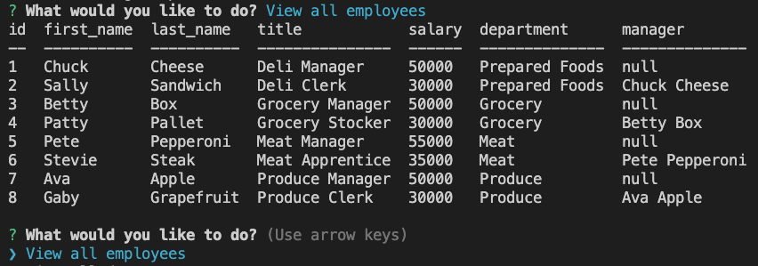

# Employee Tracker

## Description 

This app will help companies stay organized with their employee data. Companies can query existing employee information or update employee information. 

When initiated, this app presents the user with a series of choices. Depending on the choice the user makes, they will either be able to view or alter data.

  
## Table of Contents 
* [Installation](#installation)
* [Instructions](#instructions)
* [Languages & Tools](#languages-tools)
* [Credits](#credits)
* [Questions](#questions)





  
## Installation

Users will need Node.js, Inquirer, Express, and MySQL2.
  
## Instructions 

Clone repository:
```
git clone <repository link>
```

Add all dependencies:
```
npm install
```
Sign into MySQL:
```
mysql -u root -p
```
Import database:
```
source db/db.sql
```
Import schema:
```
source db/schema.sql
```
Import seeds:
```
source seeds.sql
```
Exit MySQL:
```
quit
```
Initiate the app:
```
node server.js
```

1. Select a choice from the list.
2. Answer questions, if applicable.
3. Continue selecting choicesa, as needed.
4. View, add, update information, as needed.

[App Demo Video](https://watch.screencastify.com/v/cL3W8P0wV9iu4ffjihSJ)

## Languages & Tools

* JavaScript
* Node.js
* Inquirer
* Express
* Heroku
* MySQL2

## Credits

1. Lauren Groh 
2. Help from UW Extended Campus Trilogy bootcamp TAs Maria Wong and Raj Rai, Triology tutor Ismael Lopez, Trilogy materials, and the below resources:
 * [Steve Griffith - Prof3ssorSt3v3](https://youtu.be/UQK9_gKQHZg)
 * [w3 Schooles](https://www.w3schools.com/sql/sql_unique.asp)
 * [Stack Overflow](https://stackoverflow.com/questions/43511183/mysql-error-1822-failed-to-add-foreign-key-constraint-missing-index-for-contra)
 * [Becoming a Data Scientist](https://youtu.be/5tEApCGgpEQ)
 * [Socratica](https://youtu.be/9yeOJ0ZMUYw)
 * [Socratica](https://youtu.be/VkabxQgtGsA)
 * [Joey Blue](https://youtu.be/rh89W10Su58)

## Questions

If you have any questions please connect with me through [GitHub](https://github.com/GrohTech) or [legroh@uwm.edu](mailto:legroh@uwm.edu).